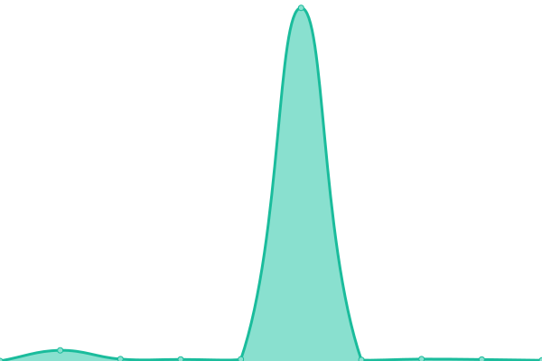

# [📈 Live Status](https://status.dtdhomelab.com): <!--live status--> **🟧 Partial outage**

This repository contains the open-source uptime monitor and status page for [DevanTheDude](https://status.dtdhomelab.com), powered by [Upptime](https://github.com/upptime/upptime).

With [Upptime](https://upptime.js.org), you can get your own unlimited and free uptime monitor and status page, powered entirely by a GitHub repository. We use [Issues](https://github.com/DevanTheDude/DTDHomelab/issues) as incident reports, [Actions](https://github.com/DevanTheDude/DTDHomelab/actions) as uptime monitors, and [Pages](https://status.dtdhomelab.com) for the status page.

<!--start: status pages-->
<!-- This summary is generated by Upptime (https://github.com/upptime/upptime) -->
<!-- Do not edit this manually, your changes will be overwritten -->
<!-- prettier-ignore -->
| URL | Status | History | Response Time | Uptime |
| --- | ------ | ------- | ------------- | ------ |
|  [Google](https://www.google.com) | 🟩 Up | [google.yml](https://github.com/DevanTheDude/DTDHomelab/commits/HEAD/history/google.yml) | 

 129ms
     
 | 

<a href="https://status.dtdhomelab.com/history/google">100.00%</a>
    

|  [DTDHomelab](https://dtdhomelab.com/) | 🟩 Up | [dtd-homelab.yml](https://github.com/DevanTheDude/DTDHomelab/commits/HEAD/history/dtd-homelab.yml) | 

 815ms
     
 | 

<a href="https://status.dtdhomelab.com/history/dtd-homelab">100.00%</a>
    

|  [Stable Diffusion](https://artstatus.dtdhomelab.com/) | 🟥 Down | [stable-diffusion.yml](https://github.com/DevanTheDude/DTDHomelab/commits/HEAD/history/stable-diffusion.yml) | 

 672ms
     
 | 

<a href="https://status.dtdhomelab.com/history/stable-diffusion">99.97%</a>
    

|  [Wiki](https://wiki.dtdhomelab.com/) | 🟩 Up | [wiki.yml](https://github.com/DevanTheDude/DTDHomelab/commits/HEAD/history/wiki.yml) | 

 699ms
     
 | 

<a href="https://status.dtdhomelab.com/history/wiki">100.00%</a>
    

|  [PHP](https://php.dtdhomelab.com/) | 🟩 Up | [php.yml](https://github.com/DevanTheDude/DTDHomelab/commits/HEAD/history/php.yml) | 

 1289ms
     
 | 

<a href="https://status.dtdhomelab.com/history/php">100.00%</a>
    

<!--end: status pages-->

[**Visit our status website →**](https://status.dtdhomelab.com)

## 📄 License

- Powered by: [Upptime](https://github.com/upptime/upptime)
- Code: [MIT](./LICENSE) © [DevanTheDude](https://status.dtdhomelab.com)
- Data in the `./history` directory: [Open Database License](https://opendatacommons.org/licenses/odbl/1-0/)
