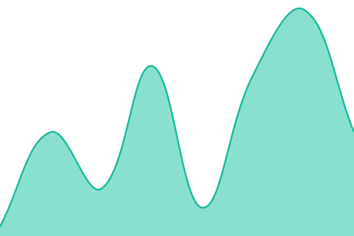
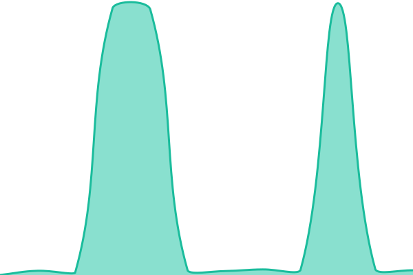
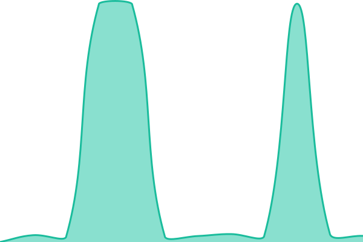
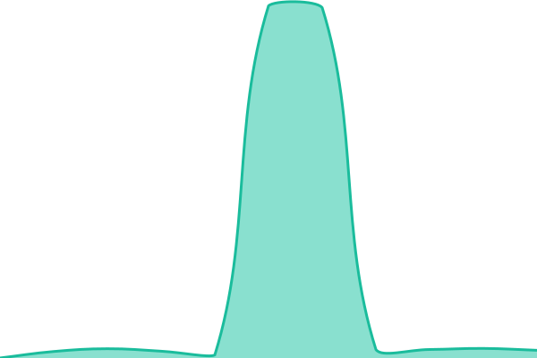
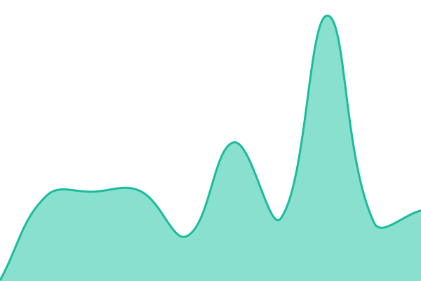
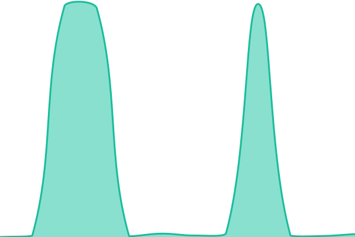
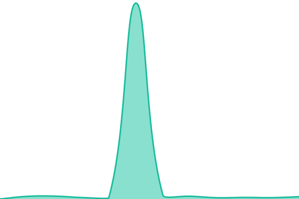

# [📈 Live Status](https://status.dtdhomelab.com): <!--live status--> **🟧 Partial outage**

This repository contains the open-source uptime monitor and status page for [DevanTheDude](https://status.dtdhomelab.com), powered by [Upptime](https://github.com/upptime/upptime).

With [Upptime](https://upptime.js.org), you can get your own unlimited and free uptime monitor and status page, powered entirely by a GitHub repository. We use [Issues](https://github.com/DevanTheDude/DTDHomelab/issues) as incident reports, [Actions](https://github.com/DevanTheDude/DTDHomelab/actions) as uptime monitors, and [Pages](https://status.dtdhomelab.com) for the status page.

<!--start: status pages-->
<!-- This summary is generated by Upptime (https://github.com/upptime/upptime) -->
<!-- Do not edit this manually, your changes will be overwritten -->
<!-- prettier-ignore -->
| URL | Status | History | Response Time | Uptime |
| --- | ------ | ------- | ------------- | ------ |
|  [DTDHomelab Internet](dtdhomelab.com) | 🟩 Up | [dtd-homelab-internet.yml](https://github.com/DevanTheDude/DTDHomelab/commits/HEAD/history/dtd-homelab-internet.yml) | 

 7ms
     
 | 

<a href="https://status.dtdhomelab.com/history/dtd-homelab-internet">100.00%</a>
    

|  [Web Server](https://statuscheck.dtdhomelab.com/) | 🟥 Down | [web-server.yml](https://github.com/DevanTheDude/DTDHomelab/commits/HEAD/history/web-server.yml) | 

 5099ms
     
 | 

<a href="https://status.dtdhomelab.com/history/web-server">80.75%</a>
    

|  [Stable Diffusion](https://statuscheck.dtdhomelab.com/) | 🟥 Down | [stable-diffusion.yml](https://github.com/DevanTheDude/DTDHomelab/commits/HEAD/history/stable-diffusion.yml) | 

 2964ms
     
 | 

<a href="https://status.dtdhomelab.com/history/stable-diffusion">0.00%</a>
    

|  [Wiki](https://wiki.dtdhomelab.com/) | 🟥 Down | [wiki.yml](https://github.com/DevanTheDude/DTDHomelab/commits/HEAD/history/wiki.yml) | 

 5274ms
     
 | 

<a href="https://status.dtdhomelab.com/history/wiki">80.80%</a>
    

|  [Remote Access](https://statuscheck.dtdhomelab.com/) | 🟥 Down | [remote-access.yml](https://github.com/DevanTheDude/DTDHomelab/commits/HEAD/history/remote-access.yml) | 

 4993ms
     
 | 

<a href="https://status.dtdhomelab.com/history/remote-access">80.82%</a>
    

|  [PHP](https://php.dtdhomelab.com/) | 🟥 Down | [php.yml](https://github.com/DevanTheDude/DTDHomelab/commits/HEAD/history/php.yml) | 

 5186ms
     
 | 

<a href="https://status.dtdhomelab.com/history/php">80.85%</a>
    

|  [SQL](https://statuscheck.dtdhomelab.com/) | 🟥 Down | [sql.yml](https://github.com/DevanTheDude/DTDHomelab/commits/HEAD/history/sql.yml) | 

 5072ms
     
 | 

<a href="https://status.dtdhomelab.com/history/sql">80.87%</a>
    

|  [Plex](https://statuscheck.dtdhomelab.com/) | 🟥 Down | [plex.yml](https://github.com/DevanTheDude/DTDHomelab/commits/HEAD/history/plex.yml) | 

 4999ms
     
 | 

<a href="https://status.dtdhomelab.com/history/plex">80.90%</a>
    

|  [Health Dashboard](https://statuscheck.dtdhomelab.com/) | 🟥 Down | [health-dashboard.yml](https://github.com/DevanTheDude/DTDHomelab/commits/HEAD/history/health-dashboard.yml) | 

 5061ms
     
 | 

<a href="https://status.dtdhomelab.com/history/health-dashboard">80.92%</a>
    

|  [OPDS](https://statuscheck.dtdhomelab.com/) | 🟥 Down | [opds.yml](https://github.com/DevanTheDude/DTDHomelab/commits/HEAD/history/opds.yml) | 

 5007ms
     
 | 

<a href="https://status.dtdhomelab.com/history/opds">83.24%</a>
    

<!--end: status pages-->

[**Visit our status website →**](https://status.dtdhomelab.com)

## 📄 License

- Powered by: [Upptime](https://github.com/upptime/upptime)
- Code: [MIT](./LICENSE) © [DevanTheDude](https://status.dtdhomelab.com)
- Data in the `./history` directory: [Open Database License](https://opendatacommons.org/licenses/odbl/1-0/)
